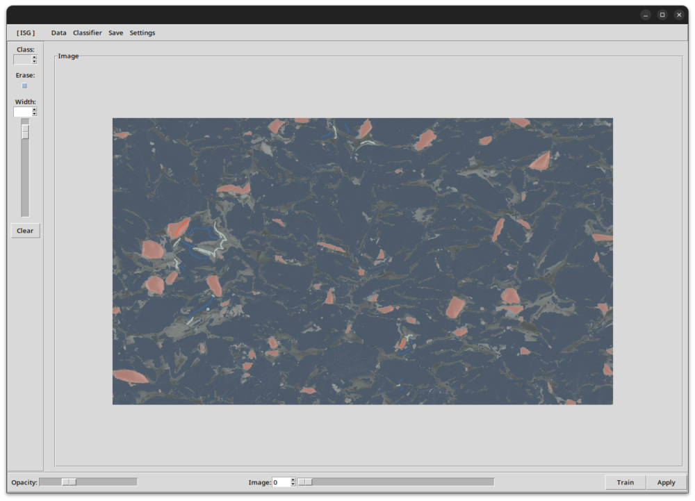

# interactive-seg-gui
GUI for tkinter interactive segmentation app.

<p align="center">
    
</p>


## Installation:

```bash
curl -LsSf https://astral.sh/uv/install.sh | sh
# restart your shell
```

```bash
git clone https://github.com/tldr-group/interactive-seg-gui
```

```bash
uv sync --extra cpu
# or for GPU deps
uv sync --extra gpu
```

If you want to use deep features, you'll need to download the checkpoints:

```bash
chmod +x repo/download_chkpoints.sh
./repo/download_chkpoints.sh
```

Make sure your `.env` file correctly points to where the models are stored.

## Basic use:

1. Add data via `Data>Add Image`. Features will be computed on upload.
2. Draw labels onto the image to give examples of each class. Use the number keys (1, 2, 3, ...) to change class.
3. Press `Train` to train a classifier on the labels and apply it to the image.

## Advanced tips:

- You can edit the `isb_cfg.json` file (i.e to change features, post-processing values, ...) whilst the app is running. Press `Settings>Reload Config` for those changes to be updated on the app. If you want to change the feature stacks after changing the config, press `Settings>Re-featurise`.
- Hold the `Ctrl` key and move the mouse to pan the image
- New labels don't overwrite previous labels, you can use this to create good interfacial labels. 
- Labels can be saved to disk and loaded again later (`Save>Save Labels`). 
- Comment / uncomment the MODEL_ environment variables in the `.env` to try different deep feature checkpoints.